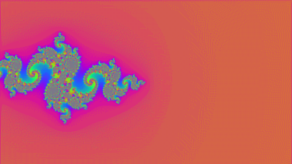
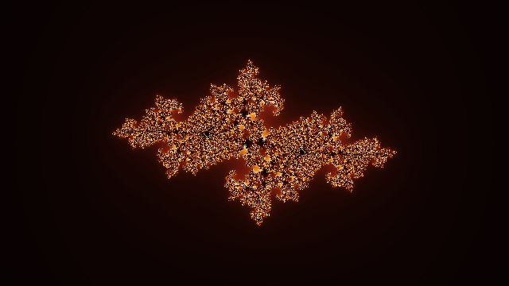
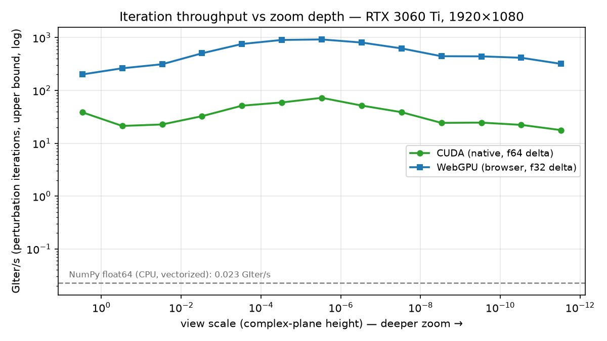
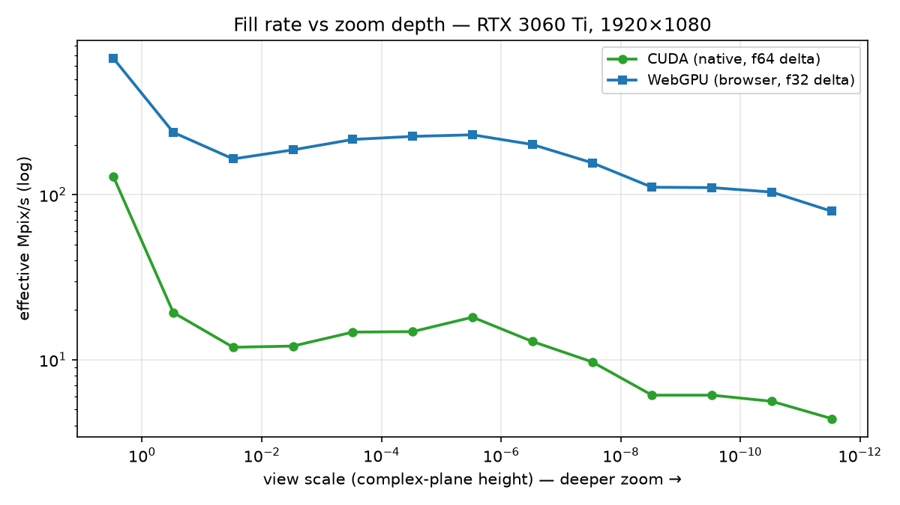

# FractalFlow

[](https://github.com/Timmor77/FractalFlow/actions/workflows/ci.yml)
[](LICENSE)


[](paper/main.pdf)

Interactive, deep-zoom **Julia set explorer**. One algorithm — *perturbation theory* —
implemented three times, in **WGSL**, **GLSL** and **CUDA C**, and cross-validated
pixel-for-pixel against an arbitrary-precision reference.

**[▶ Live demo](https://timmor77.github.io/FractalFlow/)** — WebGPU in Chrome/Edge,
automatic WebGL2 fallback elsewhere.

<p align="center">
  <!-- Native width (matches make_zoom_gif.py --width): browser upscaling would blur it. -->
  
</p>

## Highlights

- **Deep zoom to ~10⁻²⁸ in the browser** — far beyond float32 (~10⁻⁵) and float64
  (~10⁻¹⁴) — using perturbation theory with a double-double reference orbit.
- **Same math, three GPU stacks**: a WGSL fragment shader (WebGPU), a double-single
  GLSL fallback (WebGL2) and a native CUDA kernel, all sharing one algorithm.
- **Validated, not eyeballed**: renders are compared pixel-for-pixel against an
  independent `mpmath` arbitrary-precision implementation — which caught a real
  off-centre rebasing bug during development.
- **Measured**: ~0.9 **trillion** iterations/second in the browser on an RTX 3060 Ti,
  ~40 000× a vectorized NumPy baseline ([benchmarks below](#benchmarks)).

## Gallery

Every image links to the live demo with that exact view encoded in the URL —
the share-a-view feature demonstrating itself.

| | |
|:---:|:---:|
| [](https://timmor77.github.io/FractalFlow/#x=0_0&y=0_0&s=3&cx=-0.8&cy=0.156&p=0) | [](https://timmor77.github.io/FractalFlow/#x=0_0&y=0_0&s=3&cx=0.285&cy=0.01&p=0) |
| `c = -0.8 + 0.156i` | `c = 0.285 + 0.01i` |
| [](https://timmor77.github.io/FractalFlow/#x=0_0&y=0_0&s=3&cx=-0.7269&cy=0.1889&p=2) | [](https://timmor77.github.io/FractalFlow/#x=0_0&y=0_0&s=3&cx=-0.4&cy=0.6&p=4) |
| `c = -0.7269 + 0.1889i` | `c = -0.4 + 0.6i` |

## Why perturbation theory?

Zooming far into a fractal is a *precision* problem. Iterating `z = z² + c` in plain
`float32` pixelates around `1e-5`; even `double` dies near `1e-15`. The trick that
unlocks real depth is **perturbation**:

1. Compute the orbit of a single **reference point** (the view centre) **once on the
   CPU** in high precision (double-double, ~31 digits).
2. Every pixel then tracks only a tiny **delta** `δ` from that reference, in cheap
   `f32` (WebGPU) or `double` (CUDA).

For a Julia set `c` is constant, so the delta recurrence has **no `δc` term** and stays
beautifully simple:

```
z_n = Z[m] + δ                     // full value (Z = reference orbit)
δ'  = 2·Z[m]·δ + δ²                // advance the delta
```

Glitches and an escaping reference are handled with **Zhuoran rebasing**: when `δ` loses
precision (`|z − Z₀| < |δ|`) or the reference runs out, we restart from `Z[0]` with
`δ = z − Z₀`. The GPU never sees the absolute coordinate — only the reference orbit and a
small per-pixel delta — so the shader is actually *simpler* than a naïve high-precision
one, and much faster.

One subtlety: the reference orbit is uploaded **relative to Z₀** (`D[m] = Z[m] − Z₀`,
computed in double-double). Absolute `f32` orbit values would quantise the rebased delta
`D[m] + δ` to the ~1e-7 grid of O(1) numbers — near a fixed point, where deltas shrink
with the zoom, neighbouring pixels would collapse onto the same delta and dissolve the
image into blocky noise. As offsets, both terms are small exactly when precision matters.

The high-precision centre is stored as a **double-double** value (two `float64`s, where
the second holds the rounding error of the first), which is what lets the browser reach
~`1e-28` zoom.

<p align="center">
  
</p>

*Rendered in the browser at ×10⁶ zoom, centred on a repelling fixed point of
`z² + c` — a point that provably lies on the Julia set, so there is structure at
every depth.*

## Architecture

```
src/
  core/
    doubleDouble.ts     # double-double arithmetic (TwoSum / Dekker TwoProd)
    viewport.ts         # camera: DD centre, inertial zoom-at-cursor, pan
    referenceOrbit.ts   # perturbation reference orbit (shared idea across backends)
    types.ts            # Renderer interface + ViewState
    config.ts           # shared constants (c, iteration counts)
  backends/
    webgpu/             # primary: perturbation fragment shader in WGSL (f32)
    webgl/              # fallback: double-single shader in GLSL (works everywhere)
  bench/                # reproducible in-browser benchmark harness (open /?bench)
  controls/             # wheel / drag / pinch / keyboard → viewport
  ui/                   # palettes, Mandelbrot c-picker, stats overlay, panel
  main.ts               # picks WebGPU, falls back to WebGL2, runs the loop
cuda/
  julia.cu              # native renderer + benchmark (DD host orbit, f64 deltas)
scripts/
  reference_julia.py    # mpmath ground-truth renderer (validation) + CPU baseline
  benchmark.py          # benchmark CSVs → summary + charts
  make_zoom_gif.py      # renders the hero GIF via the CUDA backend
tests/                  # vitest suite for the math core
```

| Backend | Delta precision | Max zoom | Role |
|---------|-----------------|----------|------|
| WebGPU  | `f32`, DD centre | ~`1e-28` | Primary browser renderer |
| WebGL2  | double-single (`f32²`), direct iteration | driver-dependent | Compatibility fallback |
| CUDA    | `double`, DD centre | ~`1e-28` | Native renderer + benchmark |

## Benchmarks

Same workload on every backend: 13 zoom depths from `3` down to `3×10⁻¹²`,
`maxIter = min(300 + 800k, 4000)`, at 1920×1080, on an **RTX 3060 Ti**.



The counter-intuitive headline: **the browser out-runs native CUDA by ~15×** here.
Not magic — the WebGPU shader iterates deltas in `f32`, while the CUDA kernel uses
`f64`, and consumer Ampere executes fp64 at 1/64 of fp32 rate. That is precisely the
trade perturbation theory exploits: do the precision-critical work once on the CPU
(double-double reference orbit), and let the GPU crunch cheap low-precision deltas.
The two implementations bracket the speed/precision spectrum. The frozen
pixel-level validation matrix covers CUDA; WebGPU has unit-test and luma
sanity coverage but is not claimed as pixel-validated in this release.



Peak numbers: **~1,168 GIter/s / 518 Mpix/s** (WebGPU, f32) vs **~76.6 GIter/s /
139 Mpix/s** (CUDA, f64) vs **0.023 GIter/s** for vectorized NumPy float64 — a
~51 000× CPU→GPU gap on this workload.

<details>
<summary><b>Methodology & how to reproduce</b></summary>

- Median of 5 frames after 3 warm-up frames per depth. WebGPU is timed with
  `device.queue.onSubmittedWorkDone()` on an off-screen render target; CUDA with CUDA
  events; the CPU baseline times only the vectorized iteration (colouring excluded).
- GIter/s counts `pixels × maxIter` and is therefore an *upper bound* (escaped pixels
  stop early). The convention is identical across backends, so comparisons hold.
- The reference orbit is CPU-side and cached; timed frames measure pure GPU work.
- Every sample includes a mean-luma readback to reject silently-black frames, and the
  WebGPU adapter/browser identity is recorded in its CSV header; the full host,
  driver and CUDA environment is frozen in `paper/data/environment.json`.
- The WebGL2 fallback is deliberately **excluded** from the charts: under ANGLE/D3D11
  its double-single compensated arithmetic is compiled with fast-math and collapses to
  plain `f32`, so beyond shallow depths its output no longer matches the validated
  backends — and throughput of a wrong image is meaningless. Its role is compatibility,
  not speed.

```bash
# 1) CUDA (writes artifacts/cuda_bench.csv)
cuda/julia.exe --bench --w 1920 --h 1080 --out artifacts/cuda_bench.csv

# 2) Browser: npm run dev, open http://localhost:5173/?bench,
#    download the CSV(s) into artifacts/

# 3) CPU baseline (writes artifacts/cpu_bench.csv)
uv run python scripts/reference_julia.py --bench

# 4) Charts (writes docs/bench_giter.png, docs/bench_mpix.png)
uv run python scripts/benchmark.py
```

</details>

## Correctness

The CUDA perturbation renderer is checked pixel-for-pixel against direct
arbitrary-precision iteration in four frozen cases:

- **Overview**: mean RGB error **0.0002/255**, 99.95% identical pixels.
- **Off-centre boundary**: mean RGB error **0.0988/255**, 99.83% of pixels
  within four channel levels; the sparse outliers lie on an iteration boundary.
- **Deep zoom (`1e-5`)**: mean RGB error **0.0002/255**, 99.95% identical.
- **Fixed-point zoom (`1e-10`)**: mean RGB error **0.0059/255**, 99.98% within
  four channel levels.

The WebGPU path is not included in this frozen pixel matrix; automating raw
WebGPU pixel export is documented as future validation work in the report.

This caught a real bug during development: the rebasing step must restart with
`δ = z − Z₀`, not `δ = z`. The two are only equal when `Z₀ = 0` (the Mandelbrot case),
so the mistake was invisible at the origin and only showed up in off-centre deep zooms.

The CPU-side math core is additionally covered by a [vitest suite](tests/README.md):
the double-double arithmetic is verified against exact BigInt ground truth
(`hi + lo === a·b` for 50-bit integer products), and the camera satisfies a
zoom-at-cursor invariant through full animated zooms.

## Run it — browser

```bash
npm install
npm run dev        # open the printed localhost URL
npm test           # vitest: double-double, viewport, reference orbit
```

WebGPU is used when available (Chrome, Edge, recent Firefox/Safari); otherwise it falls
back to WebGL2 automatically. The active backend is shown in the on-screen stats.

**Controls:** mouse wheel = zoom to cursor · click-drag = pan · touch: one finger =
pan, pinch = zoom · `R` = reset · `S` = save PNG.

The bottom-right panel offers colour palettes, a mini-Mandelbrot map to pick the
Julia `c` (drag the marker or type values), full-quality PNG export (up to 8K), and a
**shareable link** — the view (centre, zoom, `c`, palette) lives in the URL hash.

## Run it — CUDA (NVIDIA)

Requires the CUDA Toolkit (`nvcc`) and a host C++ compiler — see [cuda/README.md](cuda/README.md).

```bash
cd cuda
nvcc -O3 julia.cu -o julia

# Render a PNG (full view):
./julia --w 1600 --h 1600 --iter 500 --scale 3 --out ../artifacts/cuda.png

# Deep zoom (centre accepts high-precision decimal strings, parsed to double-double):
./julia --re 0.0304 --im -0.564 --scale 6e-3 --iter 2500 --out ../artifacts/zoom.png

# Benchmark throughput across zoom depths (writes a CSV):
./julia --bench --w 1920 --h 1080 --out ../artifacts/cuda_bench.csv
```

## Run it — Python tooling (`uv`)

Python provides an **independent ground truth** to validate the GPU backends.

```bash
uv sync

# High-precision (mpmath) reference, compared to a CUDA render of the same view:
uv run python scripts/reference_julia.py --hp --w 64 --h 64 \
    --scale 1e-5 --re 0.0304 --im -0.564 --iter 700 \
    --compare artifacts/cuda_deepval.png

# CPU baseline for the benchmark charts:
uv run python scripts/reference_julia.py --bench

# Benchmark CSVs -> summary + charts:
uv run python scripts/benchmark.py

# Hero GIF (requires the CUDA renderer):
uv run python scripts/make_zoom_gif.py
```

## Roadmap

Done: WebGL2 viewer → modular architecture → cursor-anchored inertial zoom → smooth
colouring → **WebGPU backend** → **perturbation deep zoom** → **CUDA renderer +
benchmark** → **mpmath validation** → interactive `c` + palettes → PNG export →
shareable URLs → touch/pinch → test suite + CI → cross-backend benchmarks →
**orbit-relative reference storage** (glitch-free `f32` rebasing near fixed points).

Next: quad-double centre for `1e-50+` zoom · series approximation to skip early
iterations · progressive/tiled rendering.

## Stack

TypeScript · Vite · WebGPU (WGSL) · WebGL2 (GLSL) · CUDA C · Python + `uv`
(NumPy, Pillow, mpmath, Matplotlib) · Vitest · GitHub Actions.

## Cite

The reproducible technical report
[*FractalFlow: Portable Deep-Zoom Julia Rendering with Perturbation Theory
across WebGPU and CUDA*](paper/main.pdf) documents the numerical method,
cross-backend design, validation protocol and benchmark limitations. Citation
metadata for GitHub and Zenodo is provided in [`CITATION.cff`](CITATION.cff)
and [`.zenodo.json`](.zenodo.json). DOI badges and the final BibTeX entry are
added only after the corresponding Zenodo records have been published.

## License

[Apache License 2.0](LICENSE) — free to use, modify and distribute, including
commercially, with attribution and an explicit patent grant. Copyright 2026
Timofei Amosov. `cuda/stb_image_write.h` keeps its own dual MIT/public-domain
license (nothings/stb).
