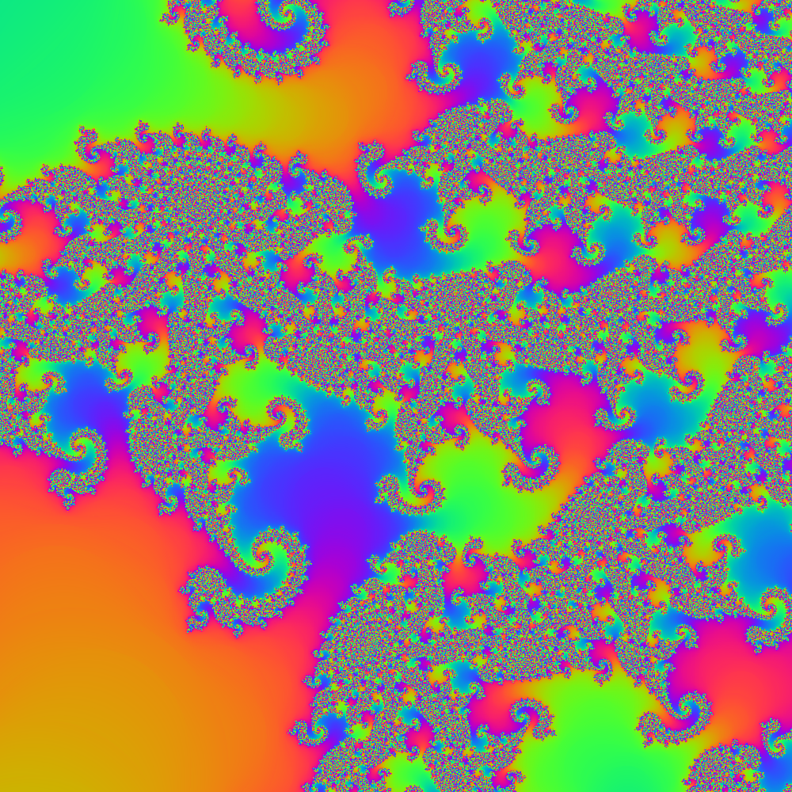
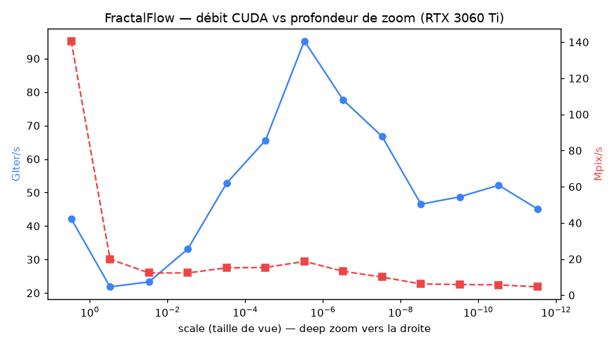

# FractalFlow

Interactive, deep-zoom **Julia set explorer**. One clean algorithm — *perturbation
theory* — rendered three ways:

- **WebGPU** in the browser (the version *for everyone*), with an automatic
  **WebGL2** fallback;
- **CUDA** natively, for maximum throughput on NVIDIA GPUs (offline renderer + benchmark).

Built with TypeScript, Vite, WGSL, CUDA and Python (`uv`).


## Why perturbation theory?

Zooming far into a fractal is a *precision* problem. Iterating `z = z² + c` in plain
`float32` pixelates around `1e-5`; even `double` dies near `1e-15`. The trick that
unlocks real depth is **perturbation**:

1. Compute the orbit of a single **reference point** (the view centre) **once on the
   CPU** in high precision (double-double, ~31 digits).
2. Every pixel then tracks only a tiny **delta** `δ` from that reference, in cheap
   `f32` (WebGPU) or `double` (CUDA).

For a Julia set `c` is constant, so the delta recurrence has **no `δc` term** and stays
beautifully simple:

```
z_n = Z[m] + δ                     // full value (Z = reference orbit)
δ'  = 2·Z[m]·δ + δ²                // advance the delta
```

Glitches and an escaping reference are handled with **Zhuoran rebasing**: when `δ` loses
precision (`|z − Z₀| < |δ|`) or the reference runs out, we restart from `Z[0]` with
`δ = z − Z₀`. The GPU never sees the absolute coordinate — only the reference orbit and a
small per-pixel delta — so the shader is actually *simpler* than a naïve high-precision
one, and much faster.

The high-precision centre is stored as a **double-double** value, which is what lets the
browser reach ~`1e-28` zoom (vs `~1e-14` for the plain fallback).



## Architecture

```
src/
  core/
    doubleDouble.ts     # minimal double-double arithmetic (CPU precision)
    viewport.ts         # camera: double-double centre, zoom/pan
    referenceOrbit.ts   # perturbation reference orbit (shared idea across backends)
    types.ts            # Renderer interface + ViewState
    config.ts           # shared constants (c, iteration counts)
  backends/
    webgpu/             # primary: perturbation fragment shader in WGSL (f32)
    webgl/              # fallback: double-single shader in GLSL (works everywhere)
  controls/             # mouse wheel / drag / keyboard → viewport
  ui/                   # stats overlay
  main.ts               # picks WebGPU, falls back to WebGL2, runs the loop
cuda/
  julia.cu              # native renderer + benchmark (double-double host, double device)
scripts/
  reference_julia.py    # mpmath ground-truth renderer (validation)
  benchmark.py          # benchmark CSV → summary + plot
```

The three backends implement the **same** perturbation algorithm, expressed in WGSL,
GLSL and CUDA C — a compact demonstration of the same math across three GPU stacks.

| Backend    | Precision              | Max zoom | Role                          |
|------------|------------------------|----------|-------------------------------|
| WebGPU     | `f32` delta, DD centre | ~`1e-28` | Primary browser renderer      |
| WebGL2     | double-single (`f32²`) | ~`1e-14` | Automatic fallback            |
| CUDA       | `double` delta, DD centre | ~`1e-28` | Native throughput + benchmark |

## Run it — browser

```bash
npm install
npm run dev        # open the printed localhost URL
```

WebGPU is used when available (Chrome, Edge, recent Firefox/Safari); otherwise it falls
back to WebGL2 automatically. The active backend is shown in the on-screen stats.

**Controls:** mouse wheel = zoom to cursor · click-drag = pan · `R` = reset.

## Run it — CUDA (NVIDIA)

Requires the CUDA Toolkit (`nvcc`) and a host C++ compiler.

```bash
cd cuda
nvcc -O3 julia.cu -o julia

# Render a PNG (full view):
./julia --w 1600 --h 1600 --iter 500 --scale 3 --out ../artifacts/cuda.png

# Deep zoom into a boundary point (centre accepts high-precision decimal strings):
./julia --re 0.0304 --im -0.564 --scale 6e-3 --iter 2500 --out ../artifacts/zoom.png

# Benchmark throughput across zoom depths (writes a CSV):
./julia --bench --w 1920 --h 1080 --out ../artifacts/cuda_bench.csv
```

## Run it — Python tooling (`uv`)

Python provides an **independent ground truth** to validate the GPU backends.

```bash
uv sync

# High-precision (mpmath) reference, and compare it to a CUDA render of the same view:
uv run python scripts/reference_julia.py --hp --w 64 --h 64 \
    --scale 1e-5 --re 0.0304 --im -0.564 --iter 700 \
    --compare artifacts/cuda_deepval.png

# Turn a benchmark CSV into a summary + plot:
uv run python scripts/benchmark.py
```

## Correctness

The perturbation renderers are checked pixel-for-pixel against direct iteration:

- **Full view** vs vectorised `float64`: **100 %** identical.
- **Deep zoom (`1e-5`)** vs **mpmath** arbitrary precision: **100 %** identical
  (`diff 0.000/255`) for CUDA; the WebGPU `f32` path matches within `0.04/255`.

This caught a real bug during development: the rebasing step must restart with
`δ = z − Z₀`, not `δ = z`. The two are only equal when `Z₀ = 0` (the Mandelbrot case),
so the mistake was invisible at the origin and only showed up in off-centre deep zooms.

## Benchmarks

Measured on an RTX 3060 Ti at 1920×1080 (`GIter/s` = billions of perturbation
iterations per second):



Peak ≈ **140 Mpix/s** at the full view; deep zooms trade pixels-per-second for the extra
iterations depth demands.

## Roadmap

Done: WebGL2 viewer → clean modular structure → zoom/pan/cursor-zoom → smooth colouring →
stats → **WebGPU backend** → **WebGL2 fallback** → **perturbation deep zoom** →
**CUDA renderer + benchmark** → **Python (mpmath) validation**.

Next: quad-double centre for `1e-50+` zoom · Series approximation to skip early
iterations · interactive Julia `c` and palette controls · progressive/tiled rendering.

## Stack

TypeScript · Vite · WebGPU (WGSL) · WebGL2 (GLSL) · CUDA C · Python + `uv`
(NumPy, Pillow, mpmath, Matplotlib).
